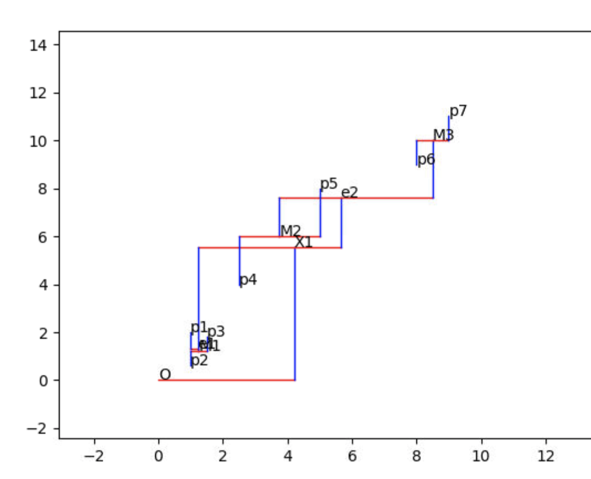

# Zero Skew Clock Routing Algorithm
## By Luke Gude
---
</img><br>
This algorithm was developed in order to emulate a clock tree routing simulation. The algorithm takes in $N$ number of points $(x,y)$ and creates a subset of points that eventually compress down into one single point that connects to the origin.
Any point on the graph is the exact same distance from the origin from any other point on the graph.   
### The Algorithm

The starting points are denoted as $p$ and compress down going to $p \rightarrow M \rightarrow e \rightarrow X \rightarrow O$ where $O$ is the origin.<br><br>
$(((1−t)x_0+tx_1), ((1−t)y_0+ty_1))$
<br><br>
This was done by using a specific formula that recursively uses the distance between the previous two points and compensates the shorter point for the longer point. Since the starting points have no parents, the mid point is used in the formula.
<br>
The program calculates the midpoint $t$ of the point and finds the square distance of both points $d$, then uses the ratio $r$ of the previous distance of both of the points $(d2-d1)/2$ where finally the $t$ is calculated with $r/d$.<br>
If $r$ is negative, then the new point will be created towards the left most point. Vice versa.

```cpp
double midX = (p1->x + p2->x) / 2;
double midY = (p1->y + p2->y) / 2;
double d = distance(p1, p2);
double ratio = (p2->distance - p1->distance) / 2;
double T = ratio / d;
double x = (((1 - T) * midX + T * p2->x));
double y = ((1 - T) * midY + T * p2->y);
p = new Point(x, y, p1, p2, dist);
p1->parent = p;
p2->parent = p;
```
<br>
The program can pass in points in arrays or through an input file an will generate a graph and output.txt.

### Output.txt:
```
1: (0, 0) to (1, 2): 0.744076 + 5.19772 +  = 6.96024
2: (0, 0) to (1, 0.6): 0.65 + 0.0940764 + 5.19772 +  = 6.96024
3: (0, 0) to (1.5, 1.8): 0.65 + 0.0940764 + 5.19772 +  = 6.96024
4: (0, 0) to (2.5, 4): 2.3585 + 2.4847 + 2.51186 +  = 6.96024
5: (0, 0) to (5, 8): 2.3585 + 2.4847 + 2.51186 +  = 6.96024
6: (0, 0) to (8, 9): 1.11803 + 3.72517 + 2.51186 +  = 6.96024
7: (0, 0) to (9, 11): 1.11803 + 3.72517 + 2.51186 +  = 6.96024
```
